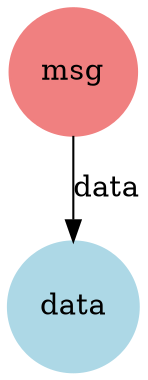

# hb_cache_render.erl - Cache Visualization

## Overview

**Purpose:** Visualize cache structure as graphs  
**Module:** `hb_cache_render`  
**Output:** DOT/SVG diagrams, JSON for web  
**Pattern:** Recursive store traversal

Renders cache storage structures as visual graphs showing relationships between messages, hashpaths, and data.

## Public Functions Overview

```erlang
%% Rendering
-spec render(StoreOrOpts) -> ok.
-spec render(ToRender, StoreOrOpts) -> ok.

%% DOT Generation
-spec cache_path_to_dot(ToRender, StoreOrOpts) -> DOT.
-spec cache_path_to_dot(ToRender, RenderOpts, StoreOrOpts) -> DOT.
-spec dot_to_svg(DOT) -> SVG.

%% Graph Data
-spec cache_path_to_graph(ToRender, RenderOpts, StoreOrOpts) -> Graph.
-spec get_graph_data(Base, MaxSize, Opts) -> {ok, JSONData}.
```

---

## Public Functions

### 1. render/1, render/2

```erlang
render(StoreOrOpts) -> ok
render(ToRender, StoreOrOpts) -> ok
```

**Description:** Generate SVG visualization and open in default viewer.

**ToRender:**
- `all` - Render entire cache
- `ID` - Render from specific ID
- `[IDs]` - Render multiple paths

**Test Code:**
```erlang
-module(hb_cache_render_render_test).
-include_lib("eunit/include/eunit.hrl").

%% render/1,2 opens file viewer - cannot unit test, verify export only
render_exported_test() ->
    code:ensure_loaded(hb_cache_render),
    ?assert(erlang:function_exported(hb_cache_render, render, 1)),
    ?assert(erlang:function_exported(hb_cache_render, render, 2)).
```

---

### 2. cache_path_to_dot/2, cache_path_to_dot/3

```erlang
cache_path_to_dot(ToRender, StoreOrOpts) -> DOT
cache_path_to_dot(ToRender, RenderOpts, StoreOrOpts) -> DOT
```

**Description:** Generate DOT graph format from cache.

**RenderOpts:**
```erlang
#{
    render_data => true | false  % Include data nodes
}
```

**Test Code:**
```erlang
-module(hb_cache_render_dot_test).
-include_lib("eunit/include/eunit.hrl").

cache_path_to_dot_format_test() ->
    TempDir = "/tmp/cache_dot_test_" ++ integer_to_list(erlang:unique_integer([positive])),
    Opts = #{store => #{<<"store-module">> => hb_store_fs, <<"name">> => list_to_binary(TempDir)}},
    
    DOT = hb_cache_render:cache_path_to_dot(all, Opts),
    
    ?assert(is_binary(DOT)),
    ?assertNotEqual(nomatch, binary:match(DOT, <<"digraph">>)),
    ?assertNotEqual(nomatch, binary:match(DOT, <<"}">>)).

cache_path_to_dot_with_render_opts_test() ->
    TempDir = "/tmp/cache_dot_opts_" ++ integer_to_list(erlang:unique_integer([positive])),
    Opts = #{store => #{<<"store-module">> => hb_store_fs, <<"name">> => list_to_binary(TempDir)}},
    RenderOpts = #{render_data => false},
    
    DOT = hb_cache_render:cache_path_to_dot(all, RenderOpts, Opts),
    
    ?assert(is_binary(DOT)),
    ?assertNotEqual(nomatch, binary:match(DOT, <<"digraph">>)).
```

---

### 3. dot_to_svg/1

```erlang
dot_to_svg(DOT) -> SVG
```

**Description:** Convert DOT graph to SVG using `dot` command.

**Requires:** Graphviz installed (`dot` in PATH)

**Test Code:**
```erlang
-module(hb_cache_render_svg_test).
-include_lib("eunit/include/eunit.hrl").

dot_to_svg_test() ->
    DOT = <<"digraph G { A -> B; }">>,
    
    % Check if graphviz is available
    case os:find_executable("dot") of
        false ->
            % Graphviz not installed - just verify function exists
            code:ensure_loaded(hb_cache_render),
            ?assert(erlang:function_exported(hb_cache_render, dot_to_svg, 1));
        _ ->
            % Graphviz available - test actual conversion
            Result = hb_cache_render:dot_to_svg(DOT),
            case Result of
                {error, timeout} ->
                    ?assert(true);
                SVG when is_binary(SVG) ->
                    ?assertNotEqual(nomatch, binary:match(SVG, <<"<svg">>)),
                    ?assertNotEqual(nomatch, binary:match(SVG, <<"</svg>">>))
            end
    end.
```

---

### 4. cache_path_to_graph/3

```erlang
cache_path_to_graph(ToRender, RenderOpts, StoreOrOpts) -> Graph
```

**Description:** Build graph data structure from cache.

**Graph Structure:**
```erlang
#{
    nodes => #{
        NodeID => {Label, Color},
        ...
    },
    arcs => #{
        {FromID, ToID, Label} => true,
        ...
    },
    visited => #{
        Path => true,
        ...
    }
}
```

**Node Colors:**
- `"lightblue"` - Simple (leaf) nodes
- `"lightcoral"` - Composite (directory) nodes

**Test Code:**
```erlang
-module(hb_cache_render_graph_test).
-include_lib("eunit/include/eunit.hrl").

cache_path_to_graph_empty_test() ->
    TempDir = "/tmp/cache_render_test_" ++ integer_to_list(erlang:unique_integer([positive])),
    Opts = #{store => #{<<"store-module">> => hb_store_fs, <<"name">> => list_to_binary(TempDir)}},
    
    Graph = hb_cache_render:cache_path_to_graph(all, #{}, Opts),
    
    ?assert(is_map(Graph)),
    ?assert(maps:is_key(nodes, Graph)),
    ?assert(maps:is_key(arcs, Graph)),
    ?assert(maps:is_key(visited, Graph)),
    
    Nodes = maps:get(nodes, Graph),
    ?assert(is_map(Nodes)).

cache_path_to_graph_with_data_test() ->
    TempDir = "/tmp/cache_render_data_" ++ integer_to_list(erlang:unique_integer([positive])),
    Opts = #{store => #{<<"store-module">> => hb_store_fs, <<"name">> => list_to_binary(TempDir)}},
    
    TestMsg = #{<<"test-key">> => <<"test-value">>, <<"data">> => <<"hello">>},
    {ok, _Path} = hb_cache:write(TestMsg, Opts),
    
    Graph = hb_cache_render:cache_path_to_graph(all, #{}, Opts),
    
    ?assert(is_map(Graph)),
    Nodes = maps:get(nodes, Graph),
    ?assert(maps:size(Nodes) > 0).
```

---

### 5. get_graph_data/3

```erlang
get_graph_data(Base, MaxSize, Opts) -> {ok, JSONResponse}
```

**Description:** Get graph data in JSON format for web visualization.

**Returns:**
```erlang
{ok, #{
    <<"body">> => JSON,
    <<"content-type">> => <<"application/json">>
}}

%% JSON structure:
{
    "nodes": [
        {"id": "...", "label": "...", "type": "simple"},
        ...
    ],
    "links": [
        {"source": "...", "target": "...", "label": "..."},
        ...
    ]
}
```

**Test Code:**
```erlang
-module(hb_cache_render_json_test).
-include_lib("eunit/include/eunit.hrl").

get_graph_data_structure_test() ->
    TempDir = "/tmp/cache_json_test_" ++ integer_to_list(erlang:unique_integer([positive])),
    Opts = #{store => #{<<"store-module">> => hb_store_fs, <<"name">> => list_to_binary(TempDir)}},
    
    {ok, Response} = hb_cache_render:get_graph_data(<<"/">>, 100, Opts),
    
    ?assert(is_map(Response)),
    ?assertEqual(<<"application/json">>, maps:get(<<"content-type">>, Response)),
    
    Body = maps:get(<<"body">>, Response),
    ?assert(is_binary(Body)),
    
    JSON = hb_json:decode(Body),
    ?assert(maps:is_key(<<"nodes">>, JSON)),
    ?assert(maps:is_key(<<"links">>, JSON)),
    ?assert(is_list(maps:get(<<"nodes">>, JSON))),
    ?assert(is_list(maps:get(<<"links">>, JSON))).

get_graph_data_max_size_test() ->
    TempDir = "/tmp/cache_maxsize_" ++ integer_to_list(erlang:unique_integer([positive])),
    Opts = #{store => #{<<"store-module">> => hb_store_fs, <<"name">> => list_to_binary(TempDir)}},
    
    {ok, Response} = hb_cache_render:get_graph_data(<<"/">>, 5, Opts),
    
    Body = maps:get(<<"body">>, Response),
    JSON = hb_json:decode(Body),
    Nodes = maps:get(<<"nodes">>, JSON),
    
    ?assert(length(Nodes) =< 5).

get_graph_data_with_content_test() ->
    TempDir = "/tmp/cache_content_" ++ integer_to_list(erlang:unique_integer([positive])),
    Opts = #{store => #{<<"store-module">> => hb_store_fs, <<"name">> => list_to_binary(TempDir)}},
    
    TestMsg = #{<<"key">> => <<"value">>, <<"data">> => <<"content">>},
    {ok, _} = hb_cache:write(TestMsg, Opts),
    
    {ok, Response} = hb_cache_render:get_graph_data(<<"/">>, 100, Opts),
    
    Body = maps:get(<<"body">>, Response),
    JSON = hb_json:decode(Body),
    Nodes = maps:get(<<"nodes">>, JSON),
    Links = maps:get(<<"links">>, JSON),
    
    % Verify structure - nodes may be empty depending on cache state
    ?assert(is_list(Nodes)),
    ?assert(is_list(Links)),
    
    % If nodes exist, verify they have required fields
    lists:foreach(fun(Node) ->
        ?assert(maps:is_key(<<"id">>, Node)),
        ?assert(maps:is_key(<<"label">>, Node)),
        ?assert(maps:is_key(<<"type">>, Node))
    end, Nodes).
```

---

## Graph Visualization

### DOT Format Example



### JSON Format Example

```json
{
  "nodes": [
    {"id": "hash1", "label": "data", "type": "simple"},
    {"id": "hash2", "label": "message", "type": "composite"}
  ],
  "links": [
    {"source": "hash2", "target": "hash1", "label": "data"}
  ]
}
```

---

## Common Patterns

```erlang
%% Visualize entire cache
render(#{store => MyStore}).

%% Visualize specific message and dependencies
render(MessageID, #{store => MyStore}).

%% Generate DOT for external processing
DOT = cache_path_to_dot(all, #{store => MyStore}),
file:write_file("cache.dot", DOT).

%% Get graph for web visualization
{ok, #{<<"body">> := JSON}} = 
    get_graph_data(<<"/">>, 1000, #{store => MyStore}),
% Send JSON to web client

%% Build custom visualization
Graph = cache_path_to_graph(all, #{}, #{store => MyStore}),
Nodes = maps:get(nodes, Graph),
Arcs = maps:get(arcs, Graph),
% Process nodes and arcs

%% Exclude data nodes (cleaner graph)
RenderOpts = #{render_data => false},
DOT = cache_path_to_dot(all, RenderOpts, #{store => MyStore}).
```

---

## Traversal Algorithm

```erlang
1. Start with root keys
2. For each key:
   a. Check if visited (avoid cycles)
   b. Mark as visited
   c. Determine type (simple/composite)
   d. Add node to graph
   e. If parent exists, add arc
   f. If composite, recursively process children
3. Return graph
```

---

## Test Data Generation

```erlang
%% Prepare test data
prepare_unsigned_data() ->
    Item = #{<<"key">> => <<"Simple unsigned data item">>},
    {ok, _} = hb_cache:write(Item, Opts).

prepare_signed_data() ->
    Wallet = ar_wallet:new(),
    Item = hb_message:commit(#{<<"key">> => <<"value">>}, Wallet),
    {ok, _} = hb_cache:write(Item, Opts).

prepare_deeply_nested_complex_message() ->
    Level3 = hb_message:commit([1,2,3], Wallet),
    Level2 = #{<<"level3">> => Level3, <<"data">> => <<"test">>},
    Level1 = hb_message:commit(Level2, Wallet),
    Outer = #{<<"level1">> => Level1},
    {ok, _} = hb_cache:write(Outer, Opts).

% Then render
render(Opts).
```

---

## Graph Properties

**Nodes:**
- ID: Storage path/hash
- Label: Last path component
- Color: Node type (blue=data, coral=composite)

**Arcs:**
- From: Parent node
- To: Child node
- Label: Key name

**Visited Tracking:**
- Prevents cycles
- Ensures each node processed once

---

## Performance

```erlang
%% Small cache (< 100 nodes)
% ~10-100ms

%% Medium cache (100-1000 nodes)
% ~100ms - 1s

%% Large cache (> 1000 nodes)
% > 1s
% Consider MaxSize limit for get_graph_data
```

---

## Graphviz Installation

```bash
# macOS
brew install graphviz

# Ubuntu/Debian
sudo apt-get install graphviz

# Verify
dot -V
```

---

## References

- **Graphviz** - Graph visualization toolkit
- **DOT Language** - Graph description language
- **hb_cache** - Cache storage system
- **hb_store** - Storage backend

---

## Notes

1. **Requires Graphviz**: `dot` command must be in PATH
2. **Cycles Avoided**: Visited tracking prevents infinite loops
3. **Data Nodes**: Can be excluded for cleaner graphs
4. **MaxSize**: Limits nodes for web visualization
5. **SVG Output**: Automatically opened on macOS
6. **JSON Format**: Compatible with D3.js, Three.js
7. **Link Resolution**: Follows links to actual data
8. **Special Case**: `/data` directory not rendered (too large)
9. **Label Extraction**: Uses last path component
10. **Color Coding**: Blue=simple, Coral=composite